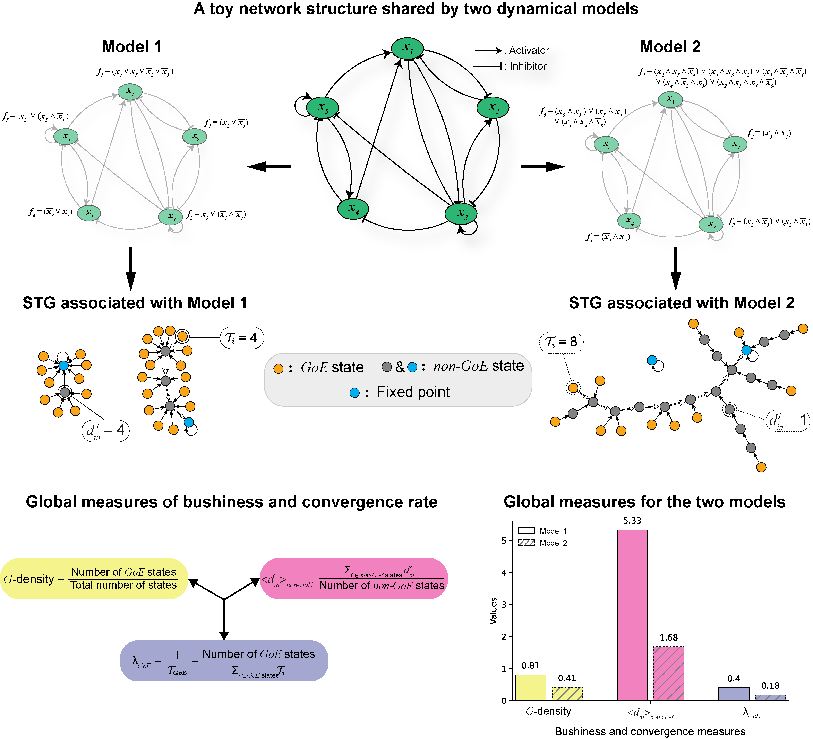

# BushySTG
## About
BushySTG repository contains the codes and data associated with the following manuscript:  
P. Sil#, A. Subbaroyan#, Saumitra Kulkarni, O. C. Martin* and A. Samal*. Biologically meaningful regulatory logic enhances the convergence rate in Boolean networks and bushiness of their state transition graph.

In this work we systematically study the effects of different classes of regulatory logic rules on the structural features ('bushiness' and 'convergence') of the STGs of reconstructed Booelan GRNs. We adapt Wuensche's Z-parameter from cellular automata to Boolean functions (BFs) in Boolean Networks (BNs) and provided multiple variants of it. Based on empirical observations we pick the best variant of those that can be a good proxy for bushiness. We also show that 'average network sensitivity' can be an equally good predictor of bushiness. Finally, we provide an excellent proxy for the ‘convergence’ based on computing transient lengths originating at random states rather than Garden-of-Eden (GoE) states.

The folders in this repository are:

### 1. codes:
Contains all the codes necessary for reproducing the results in this manuscript.

### 2. data:
Contains all the data necessary for reproducing the results in this manuscript.

## CITATION
P. Sil#, A. Subbaroyan#, Saumitra Kulkarni, O. C. Martin* and A. Samal*. Biologically meaningful regulatory logic enhances the convergence rate in Boolean networks and bushiness of their state transition graph.
